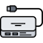

# iTop-br-peripherals

Copyright (c) 2024 Björn Rudner

## What?

Adds monitor, docking station, keyboard, mouse, headset

## Dependencies

* iTop End-User Devices (itop-endusers-devices/2.7.5) needs to be enabled during setup

## Attribution

This Extension uses Icons from:

 [Docking Station Icon](https://www.flaticon.com/free-icons/usb-hub) Usb-hub icons created by Nikita Golubev - Flaticon

 [Monitor Icon](https://www.flaticon.com/free-icons/monitor) Monitor icons created by xnimrodx - Flaticon

 [Headset Icon](https://www.flaticon.com/free-icons/headset) Headset icons created by Freepik - Flaticon

 [Mouse Icon](https://www.flaticon.com/free-icons/computer)Computer icons created by surang - Flaticon

 [Keyboard Icon](https://www.flaticon.com/free-icons/electric-keyboard) Electric keyboard icons created by Iconic Panda - Flaticon

 [Barcode Scanner Icon](https://www.flaticon.com/free-icons/barcode-scanner) Barcode scanner icons created by Freepik - Flaticon
