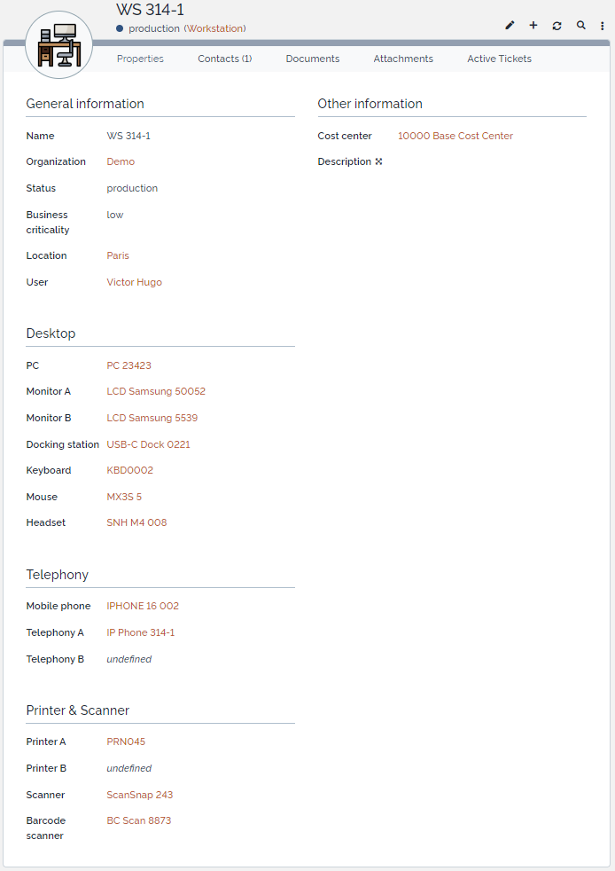

# iTop-br-peripherals

Copyright (c) 2024-2025 Björn Rudner
[](https://github.com/rudnerbjoern/iTop-br-peripherals/blob/main/LICENSE)

## What?

Adds the classes [monitor](#monitor), [docking station](#dockingstation), [keyboard](#keyboard), [mouse](#mouse), [headset](#headset), [scanner](#scanner), [barcode scanner](#barcodescanner), [conference system](#conferencesystem) to iTop Configuration Management.

Adds additional fields to the classes [PC](#pc), [Mobile Phone](#mobilephone), [IP Phone](#ipphone) and [Printer](#printer).

### End user devices


### Workstation in use



### Relations


## Dependencies

* iTop End-User Devices (`itop-endusers-devices`) needs to be enabled during setup

## Installation

Place the extension in the `extensions` folder of your iTop instance and run iTop setup again.
Be sure to enable the extension during setup.

## Configuration

After installation, it is possible to change some settings in the iTop configuration.

```php
/**
 * Modules specific settings
 */
$MyModuleSettings = array(
   'br-peripherals' => array (
      // update Contact of linked peripherals to the User of the workstation
      'update_contacts_from_workstation' => 'true',
      // update location of linked peripherals to the location of the workstation
      'update_locations_from_workstation' => 'true',
      // only available in conjunction with br-costcenter; update CostCenter of linked peripherals to the CostCenter of the workstation
      'update_costcenters_from_workstation' => 'true',
   ),
);
```

### update_contacts_from_workstation

Decide whether the user of a workstation should be added to the contacts of the assigned peripheral devices.

* `true`
* `false` (default)

### update_locations_from_workstation

Decide whether the location of peripheral devices assigned to a workstation should match the location of the workstation.

* `true`
* `false` (default)

### update_costcenters_from_workstation

Decide whether the cost center of peripheral devices assigned to a workstation should match the workstation's cost center.

Additionally, ensure that the iTop extension [iTop-br-costcenter](https://github.com/rudnerbjoern/iTop-br-costcenter) is installed for this functionality.

* `true`
* `false` (default)

## Classes

### Workstation


The class `Workstation` is a child class of `PhysicalDevice`.

#### Properties of Workstation

| Name                 | Type                                                                   | Mandatory? |
| -------------------- | ---------------------------------------------------------------------- | ---------- |
| Name                 | Alphanumeric string                                                    | Yes        |
| Organization         | Foreign key to a(n) Organization                                       | Yes        |
| Status               | Possible values: Production (default), Stock, Implementation, Obsolete | Yes        |
| Business criticality | Possible values: Low (default), Medium, High                           | No         |
| Location             | Foreign key to a Location                                              | No         |
| User                 | Foreign key to a Person/Contact                                        | No         |
| PC                   | Foreign key to a [PC](#pc)                                             | Yes        |
| Secondary PC         | Foreign key to a [PC](#pc)                                             | No         |
| Docking Station      | Foreign key to a [Docking Station](#dockingstation)                    | No         |
| Monitor A            | Foreign key to a [Monitor](#monitor)                                   | No         |
| Monitor B            | Foreign key to a [Monitor](#monitor)                                   | No         |
| Keyboard             | Foreign key to a [Keyboard](#keyboard)                                 | No         |
| Mouse                | Foreign key to a [Mouse](#mouse)                                       | No         |
| Headset              | Foreign key to a [Headset](#headset)                                   | No         |
| Mobile Phone         | Foreign key to a [Mobile Phone](#mobilephone)                          | No         |
| Telephone A          | Foreign key to a Telephony CI                                          | No         |
| Telephone B          | Foreign key to a Telephony CI                                          | No         |
| Printer A            | Foreign key to a [Printer](#printer)                                   | No         |
| Printer B            | Foreign key to a [Printer](#printer)                                   | No         |
| Scanner              | Foreign key to a [Scanner](#scanner)                                   | No         |
| Barcode Scanner      | Foreign key to a [Barcode Scanner](#barcodescanner)                    | No         |
| Cost center          | (if installed) Foreign key to a Cost Center                            | No         |
| Description          | Multiline character string                                             | No         |

#### Tabs of Workstation

| Tab                 | Description                                         |
| ------------------- | --------------------------------------------------- |
| Contacts            | All the contacts for the Docking station            |
| Documents           | All the documents for the Docking station           |
| Physical interfaces | All the Physical interfaces for the Docking station |
| Network devices     | All the Network devices for the Docking station     |
| Provider contracts  | All the Provider contracts for the Docking station  |
| Services            | All the services for the Docking station            |

#### Automation

If enabled by the setting `update_locations_from_workstation` the assigned `Location`
will also set the specific location on the following linked items:
`PC`, `Docking Station`,  `Monitor A`, `Monitor B`, `Keyboard`, `Mouse`,
`Headset`, `Mobile Phone`, `Telephone A`, `Telephone B`, `Printer A`, `Printer B`,
`Scanner`, `Barcode Scanner`

If enabled by the setting `update_contacts_from_workstation` the assigned `User`
will also add to the Contacts of the `Workstation` itself and on the following linked items:
`PC`, `Docking Station`,  `Monitor A`, `Monitor B`, `Keyboard`, `Mouse`,
`Headset`, `Mobile Phone`, `Telephone A`, `Telephone B`, `Printer A`, `Printer B`,
`Scanner`, `Barcode Scanner`

If the User is removed or changed it will also get removed or changed on the linked items.

### PC

This extension enhances the class `PC` from the iTop extension `itop-endusers-devices`.

| Name                 | Type                                                                   | Mandatory? | Readonly? |
| -------------------- | ---------------------------------------------------------------------- | ---------- | --------- |
| Name                 | Alphanumeric string                                                    | Yes        |           |
| Organization         | Foreign key to a(n) Organization                                       | Yes        |           |
| Status               | Possible values: Production (default), Stock, Implementation, Obsolete | Yes        |           |
| Business criticality | Possible values: Low (default), Medium, High                           | No         |           |
| Location             | Foreign key to a Location                                              | No         |           |
| Workstation          | Foreign key to a [Workstation](#workstation)                           | No         | Yes       |

### DockingStation


The class `DockingStation` is a child class of `ConnectableCI`.

#### Properties of DockingStation

| Name                 | Type                                                                   | Mandatory? | Readonly? |
| -------------------- | ---------------------------------------------------------------------- | ---------- | --------- |
| Name                 | Alphanumeric string                                                    | Yes        |           |
| Organization         | Foreign key to a(n) Organization                                       | Yes        |           |
| Status               | Possible values: Production (default), Stock, Implementation, Obsolete | Yes        |           |
| Business criticality | Possible values: Low (default), Medium, High                           | No         |           |
| Location             | Foreign key to a Location                                              | No         |           |
| Workstation          | Foreign key to a [Workstation](#workstation)                           | No         | Yes       |
| Brand                | Foreign key to a Brand                                                 | No         |           |
| Model                | Foreign key to a Model                                                 | No         |           |
| MAC Address          | MAC Address                                                            | No         |           |
| IP Address           | Foreign key to an IP Address                                           | No         |           |
| Serial number        | Alphanumeric string                                                    | No         |           |
| Asset tag            | Alphanumeric string                                                    | No         |           |
| Move to production   | Date (year-month-day)                                                  | No         |           |
| Purchase date        | Date (year-month-day)                                                  | No         |           |
| End of warranty      | Date (year-month-day)                                                  | No         |           |

#### Tabs of DockingStation

| Tab                 | Description                                         |
| ------------------- | --------------------------------------------------- |
| Contacts            | All the contacts for the Docking station            |
| Documents           | All the documents for the Docking station           |
| Physical interfaces | All the Physical interfaces for the Docking station |
| Network devices     | All the Network devices for the Docking station     |
| Provider contracts  | All the Provider contracts for the Docking station  |
| Services            | All the services for the Docking station            |

### Monitor


The class `Monitor` is a child class of `Peripheral`.

#### Properties of Monitor

| Name                 | Type                                                                   | Mandatory? | Readonly? |
| -------------------- | ---------------------------------------------------------------------- | ---------- | --------- |
| Name                 | Alphanumeric string                                                    | Yes        |           |
| Organization         | Foreign key to a(n) Organization                                       | Yes        |           |
| Status               | Possible values: Production (default), Stock, Implementation, Obsolete | Yes        |           |
| Business criticality | Possible values: Low (default), Medium, High                           | No         |           |
| Location             | Foreign key to a Location                                              | No         |           |
| Workstation          | Foreign key to a [Workstation](#workstation)                           | No         | Yes       |
| Brand                | Foreign key to a Brand                                                 | No         |           |
| Model                | Foreign key to a Model                                                 | No         |           |
| Serial number        | Alphanumeric string                                                    | No         |           |
| Asset tag            | Alphanumeric string                                                    | No         |           |
| Move to production   | Date (year-month-day)                                                  | No         |           |
| Purchase date        | Date (year-month-day)                                                  | No         |           |
| End of warranty      | Date (year-month-day)                                                  | No         |           |

#### Tabs of Monitor

| Tab                | Description                                        |
| ------------------ | -------------------------------------------------- |
| Contacts           | All the contacts for the Docking station           |
| Documents          | All the documents for the Docking station          |
| Provider contracts | All the Provider contracts for the Docking station |
| Services           | All the services for the Docking station           |

### Keyboard


The class `Keyboard` is a child class of `Peripheral`.

#### Properties of Keyboard

| Name                 | Type                                                                   | Mandatory? | Readonly? |
| -------------------- | ---------------------------------------------------------------------- | ---------- | --------- |
| Name                 | Alphanumeric string                                                    | Yes        |           |
| Organization         | Foreign key to a(n) Organization                                       | Yes        |           |
| Status               | Possible values: Production (default), Stock, Implementation, Obsolete | Yes        |           |
| Business criticality | Possible values: Low (default), Medium, High                           | No         |           |
| Location             | Foreign key to a Location                                              | No         |           |
| Workstation          | Foreign key to a [Workstation](#workstation)                           | No         | Yes       |
| Brand                | Foreign key to a Brand                                                 | No         |           |
| Model                | Foreign key to a Model                                                 | No         |           |
| Serial number        | Alphanumeric string                                                    | No         |           |
| Asset tag            | Alphanumeric string                                                    | No         |           |
| Move to production   | Date (year-month-day)                                                  | No         |           |
| Purchase date        | Date (year-month-day)                                                  | No         |           |
| End of warranty      | Date (year-month-day)                                                  | No         |           |

#### Tabs of Keyboard

| Tab                | Description                                        |
| ------------------ | -------------------------------------------------- |
| Contacts           | All the contacts for the Docking station           |
| Documents          | All the documents for the Docking station          |
| Provider contracts | All the Provider contracts for the Docking station |
| Services           | All the services for the Docking station           |

### Mouse


The class `Mouse` is a child class of `Peripheral`.

#### Properties of Mouse

| Name                 | Type                                                                   | Mandatory? | Readonly? |
| -------------------- | ---------------------------------------------------------------------- | ---------- | --------- |
| Name                 | Alphanumeric string                                                    | Yes        |           |
| Organization         | Foreign key to a(n) Organization                                       | Yes        |           |
| Status               | Possible values: Production (default), Stock, Implementation, Obsolete | Yes        |           |
| Business criticality | Possible values: Low (default), Medium, High                           | No         |           |
| Location             | Foreign key to a Location                                              | No         |           |
| Workstation          | Foreign key to a [Workstation](#workstation)                           | No         | Yes       |
| Brand                | Foreign key to a Brand                                                 | No         |           |
| Model                | Foreign key to a Model                                                 | No         |           |
| Serial number        | Alphanumeric string                                                    | No         |           |
| Asset tag            | Alphanumeric string                                                    | No         |           |
| Move to production   | Date (year-month-day)                                                  | No         |           |
| Purchase date        | Date (year-month-day)                                                  | No         |           |
| End of warranty      | Date (year-month-day)                                                  | No         |           |

#### Tabs of Mouse

| Tab                | Description                                        |
| ------------------ | -------------------------------------------------- |
| Contacts           | All the contacts for the Docking station           |
| Documents          | All the documents for the Docking station          |
| Provider contracts | All the Provider contracts for the Docking station |
| Services           | All the services for the Docking station           |

### Headset


The class `Headset` is a child class of `Peripheral`.

#### Properties of Headset

| Name                 | Type                                                                   | Mandatory? | Readonly? |
| -------------------- | ---------------------------------------------------------------------- | ---------- | --------- |
| Name                 | Alphanumeric string                                                    | Yes        |           |
| Organization         | Foreign key to a(n) Organization                                       | Yes        |           |
| Status               | Possible values: Production (default), Stock, Implementation, Obsolete | Yes        |           |
| Business criticality | Possible values: Low (default), Medium, High                           | No         |           |
| Location             | Foreign key to a Location                                              | No         |           |
| Workstation          | Foreign key to a [Workstation](#workstation)                           | No         | Yes       |
| Brand                | Foreign key to a Brand                                                 | No         |           |
| Model                | Foreign key to a Model                                                 | No         |           |
| Serial number        | Alphanumeric string                                                    | No         |           |
| Asset tag            | Alphanumeric string                                                    | No         |           |
| Move to production   | Date (year-month-day)                                                  | No         |           |
| Purchase date        | Date (year-month-day)                                                  | No         |           |
| End of warranty      | Date (year-month-day)                                                  | No         |           |

#### Tabs of Headset

| Tab                | Description                                        |
| ------------------ | -------------------------------------------------- |
| Contacts           | All the contacts for the Docking station           |
| Documents          | All the documents for the Docking station          |
| Provider contracts | All the Provider contracts for the Docking station |
| Services           | All the services for the Docking station           |

### Printer

This extension enhances the class `Printer` from the iTop extension `itop-endusers-devices`.

| Name                 | Type                                                                   | Mandatory? | Readonly? |
| -------------------- | ---------------------------------------------------------------------- | ---------- | --------- |
| Name                 | Alphanumeric string                                                    | Yes        |           |
| Organization         | Foreign key to a(n) Organization                                       | Yes        |           |
| Status               | Possible values: Production (default), Stock, Implementation, Obsolete | Yes        |           |
| Business criticality | Possible values: Low, Medium, High                                     | No         |           |
| Location             | Foreign key to a Location                                              | No         |           |
| Workstation          | Foreign key to a [Workstation](#workstation)                           | No         | Yes       |

### Scanner


The class `Scanner` is a child class of `Peripheral`.

#### Properties of Scanner

| Name                 | Type                                                                   | Mandatory? | Readonly? |
| -------------------- | ---------------------------------------------------------------------- | ---------- | --------- |
| Name                 | Alphanumeric string                                                    | Yes        |           |
| Organization         | Foreign key to a(n) Organization                                       | Yes        |           |
| Status               | Possible values: Production (default), Stock, Implementation, Obsolete | Yes        |           |
| Business criticality | Possible values: Low (default), Medium, High                           | No         |           |
| Location             | Foreign key to a Location                                              | No         |           |
| Workstation          | Foreign key to a [Workstation](#workstation)                           | No         | Yes       |
| Brand                | Foreign key to a Brand                                                 | No         |           |
| Model                | Foreign key to a Model                                                 | No         |           |
| MAC Address          | MAC Address                                                            | No         |           |
| IP Address           | Foreign key to an IP Address                                           | No         |           |
| Serial number        | Alphanumeric string                                                    | No         |           |
| Asset tag            | Alphanumeric string                                                    | No         |           |
| Move to production   | Date (year-month-day)                                                  | No         |           |
| Purchase date        | Date (year-month-day)                                                  | No         |           |
| End of warranty      | Date (year-month-day)                                                  | No         |           |

#### Tabs of Scanner

| Tab                | Description                                        |
| ------------------ | -------------------------------------------------- |
| Contacts           | All the contacts for the Docking station           |
| Documents          | All the documents for the Docking station          |
| Provider contracts | All the Provider contracts for the Docking station |
| Services           | All the services for the Docking station           |

### BarcodeScanner


The class `BarcodeScanner` is a child class of `Peripheral`.

#### Properties of BarcodeScanner

| Name                 | Type                                                                   | Mandatory? | Readonly? |
| -------------------- | ---------------------------------------------------------------------- | ---------- | --------- |
| Name                 | Alphanumeric string                                                    | Yes        |           |
| Organization         | Foreign key to a(n) Organization                                       | Yes        |           |
| Status               | Possible values: Production (default), Stock, Implementation, Obsolete | Yes        |           |
| Business criticality | Possible values: Low (default), Medium, High                           | No         |           |
| Location             | Foreign key to a Location                                              | No         |           |
| Workstation          | Foreign key to a [Workstation](#workstation)                           | No         | Yes       |
| Brand                | Foreign key to a Brand                                                 | No         |           |
| Model                | Foreign key to a Model                                                 | No         |           |
| Serial number        | Alphanumeric string                                                    | No         |           |
| Asset tag            | Alphanumeric string                                                    | No         |           |
| Move to production   | Date (year-month-day)                                                  | No         |           |
| Purchase date        | Date (year-month-day)                                                  | No         |           |
| End of warranty      | Date (year-month-day)                                                  | No         |           |

#### Tabs of BarcodeScanner

| Tab                | Description                                        |
| ------------------ | -------------------------------------------------- |
| Contacts           | All the contacts for the Docking station           |
| Documents          | All the documents for the Docking station          |
| Provider contracts | All the Provider contracts for the Docking station |
| Services           | All the services for the Docking station           |

### MobilePhone

This extension enhances the class `MobilePhone` from the iTop extension `itop-endusers-devices`.

#### Properties of MobilePhone

| Name                 | Type                                                                   | Mandatory? | Readonly? |
| -------------------- | ---------------------------------------------------------------------- | ---------- | --------- |
| Name                 | Alphanumeric string                                                    | Yes        |           |
| Organization         | Foreign key to a(n) Organization                                       | Yes        |           |
| Status               | Possible values: Production (default), Stock, Implementation, Obsolete | Yes        |           |
| Business criticality | Possible values: Low (default), Medium, High                           | No         |           |
| Location             | Foreign key to a Location                                              | No         |           |
| Workstation          | Foreign key to a [Workstation](#workstation)                           | No         | Yes       |
| Brand                | Foreign key to a Brand                                                 | No         |           |
| Model                | Foreign key to a Model                                                 | No         |           |
| Phone number         | Phone number                                                           | No         |           |
| IMEI                 | Alphanumeric string                                                    | No         |           |
| Hardware PIN         | Alphanumeric string                                                    | No         |           |
| Serial number        | Alphanumeric string                                                    | No         |           |
| Asset tag            | Alphanumeric string                                                    | No         |           |
| Move to production   | Date (year-month-day)                                                  | No         |           |
| Purchase date        | Date (year-month-day)                                                  | No         |           |
| End of warranty      | Date (year-month-day)                                                  | No         |           |

#### Tabs of MobilePhone

| Tab                | Description                                        |
| ------------------ | -------------------------------------------------- |
| Contacts           | All the contacts for the Docking station           |
| Documents          | All the documents for the Docking station          |
| Provider contracts | All the Provider contracts for the Docking station |
| Services           | All the services for the Docking station           |

### IPPhone

This extension enhances the class `IPPhone` from the iTop extension `itop-endusers-devices`.

#### Properties of IPPhone

| Name                 | Type                                                                   | Mandatory? | Readonly? |
| -------------------- | ---------------------------------------------------------------------- | ---------- | --------- |
| Name                 | Alphanumeric string                                                    | Yes        |           |
| Organization         | Foreign key to a(n) Organization                                       | Yes        |           |
| Status               | Possible values: Production (default), Stock, Implementation, Obsolete | Yes        |           |
| Business criticality | Possible values: Low (default), Medium, High                           | No         |           |
| Location             | Foreign key to a Location                                              | No         |           |
| Workstation          | Foreign key to a [Workstation](#workstation)                           | No         | Yes       |
| Brand                | Foreign key to a Brand                                                 | No         |           |
| Model                | Foreign key to a Model                                                 | No         |           |
| Phone number         | Phone number                                                           | No         |           |
| Serial number        | Alphanumeric string                                                    | No         |           |
| Asset tag            | Alphanumeric string                                                    | No         |           |
| Move to production   | Date (year-month-day)                                                  | No         |           |
| Purchase date        | Date (year-month-day)                                                  | No         |           |
| End of warranty      | Date (year-month-day)                                                  | No         |           |

#### Tabs of IPPhone

| Tab                | Description                                        |
| ------------------ | -------------------------------------------------- |
| Contacts           | All the contacts for the Docking station           |
| Documents          | All the documents for the Docking station          |
| Provider contracts | All the Provider contracts for the Docking station |
| Services           | All the services for the Docking station           |

### ConferenceSystem


The class `ConferenceSystem` is a child class of `TelephonyCI`.

#### Properties of ConferenceSystem

| Name                 | Type                                                                   | Mandatory? | Readonly? |
| -------------------- | ---------------------------------------------------------------------- | ---------- | --------- |
| Name                 | Alphanumeric string                                                    | Yes        |           |
| Organization         | Foreign key to a(n) Organization                                       | Yes        |           |
| Status               | Possible values: Production (default), Stock, Implementation, Obsolete | Yes        |           |
| Business criticality | Possible values: Low (default), Medium, High                           | No         |           |
| Location             | Foreign key to a Location                                              | No         |           |
| Workstation          | Foreign key to a [Workstation](#workstation)                           | No         | Yes       |
| Brand                | Foreign key to a Brand                                                 | No         |           |
| Model                | Foreign key to a Model                                                 | No         |           |
| Phone number         | Phone number                                                           | No         |           |
| Serial number        | Alphanumeric string                                                    | No         |           |
| Asset tag            | Alphanumeric string                                                    | No         |           |
| Move to production   | Date (year-month-day)                                                  | No         |           |
| Purchase date        | Date (year-month-day)                                                  | No         |           |
| End of warranty      | Date (year-month-day)                                                  | No         |           |

#### Tabs of ConferenceSystem

| Tab                | Description                                        |
| ------------------ | -------------------------------------------------- |
| Contacts           | All the contacts for the Docking station           |
| Documents          | All the documents for the Docking station          |
| Provider contracts | All the Provider contracts for the Docking station |
| Services           | All the services for the Docking station           |

## iTop Compatibility

The branch [2.7.10](https://github.com/rudnerbjoern/iTop-br-peripherals/tree/itop/2.7) is compatible to iTop 2.7 and iTop 3.1.

The branch [main](https://github.com/rudnerbjoern/iTop-br-peripherals/tree/main) will only be compatible to iTop 3.1 and above.

The extension was tested on iTop 2.7.10, 3.1.1 and 3.2.1.

## Attribution

This Extension uses Icons from:

 [Workstation Icon](https://www.flaticon.com/free-icons/office) Office icons created by surang - Flaticon

 [Docking Station Icon](https://www.flaticon.com/free-icons/usb-hub) Usb-hub icons created by Nikita Golubev - Flaticon

 [Monitor Icon](https://www.flaticon.com/free-icons/monitor) Monitor icons created by xnimrodx - Flaticon

 [Headset Icon](https://www.flaticon.com/free-icons/headset) Headset icons created by Freepik - Flaticon

 [Mouse Icon](https://www.flaticon.com/free-icons/computer)Computer icons created by surang - Flaticon

 [Keyboard Icon](https://www.flaticon.com/free-icons/electric-keyboard) Electric keyboard icons created by Iconic Panda - Flaticon

 [Scanner Icon](https://www.flaticon.com/free-icons/scanner) Scanner icons created by Vectors Tank - Flaticon

 [Barcode Scanner Icon](https://www.flaticon.com/free-icons/barcode-scanner) Barcode scanner icons created by Freepik - Flaticon

 [Conference System Icon](https://www.flaticon.com/free-icons/conference) Conference icons created by Freepik - Flaticon
